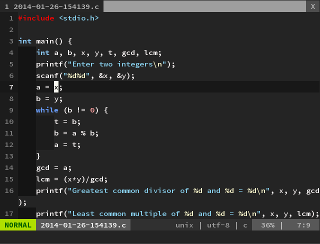
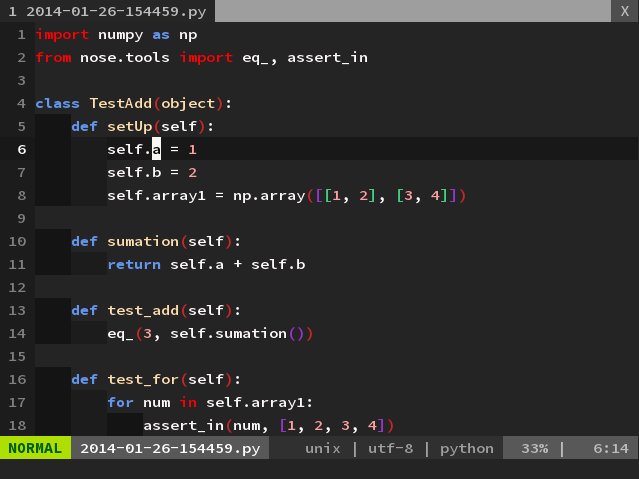
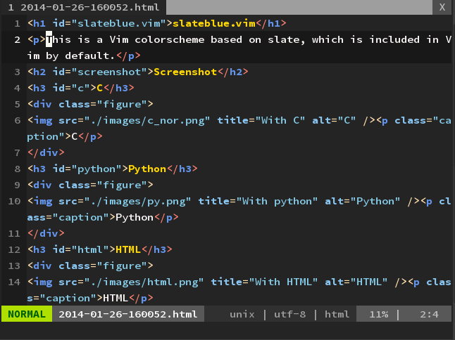

slateblue.vim
=============

This is a Vim colorscheme based on "slate" colorscheme.

Screenshots
-----------

### C 
With [vim-indent-guides](https://github.com/nathanaelkane/vim-indent-guides) and [lightline.vim](https://github.com/itchyny/lightline.vim)



### Python
With [vim-indent-guides](https://github.com/nathanaelkane/vim-indent-guides), [lightline.vim](https://github.com/itchyny/lightline.vim), and [rainbow_parenatheses.vim](https://github.com/vim-scripts/rainbow_parentheses.vim)



### HTML
With [lightline.vim](https://github.com/itchyny/lightline.vim)



Installation
------------

If you are a NeoBundle user, you can install this colorscheme by adding the below line in your vimrc and restart vim.

```vim
NeoBundle 'miyakogi/slateblue.vim'
```

Then execute `:NeoBundleInstall`.

Now you can use this colorscheme, check `:colorscheme slateblue`.
